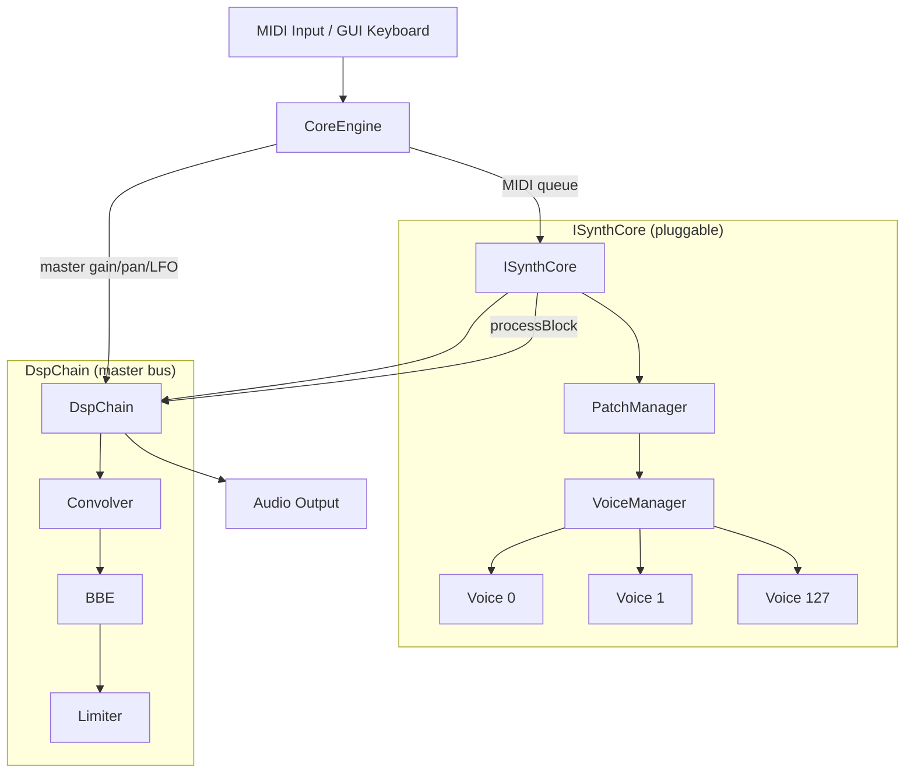
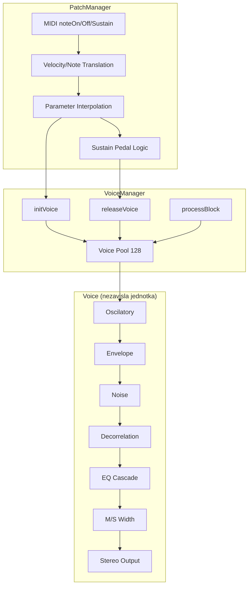
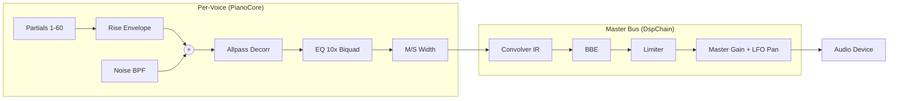

# ICR — C++ Engine Architecture

## High-Level Overview



## Three-Layer Core Architecture (Ithaca Core)

Každý ISynthCore implementuje 3-vrstvou architekturu:



---

## Layer Responsibilities

### Voice (SineVoice / PianoVoice)

Nezavisla vypocetni jednotka. Nevi o MIDI, nepristupuje ke globalnimu
stavu. Prijima parametry v nativnim float formatu a produkuje stereo audio.
Muze byt distribuovana na samostatny HW modul.

| Metoda | Popis |
|--------|-------|
| `process(out_l, out_r, n_samples, ...)` | Produkuje audio, vraci false kdyz dohasne |

| Stav (SineVoice) | Typ | Popis |
|---|---|---|
| `active` | bool | Hlas aktivni |
| `releasing` | bool | Ve fazi dohasinani |
| `phase` | float | Faze oscilatoru (rad) |
| `omega` | float | Uhlova frekvence per sample |
| `amp` | float | Cilova amplituda |
| `onset_gain/step` | float | Onset rampa (click prevention) |
| `rel_gain/step` | float | Release rampa |

| Stav (PianoVoice) — navic | Typ | Popis |
|---|---|---|
| `partials[60]` | struct | Per-partial: env_fast/slow, decay, A0, f_hz, beat_hz, phi |
| `noise_bpf` | BiquadCoeffs | Bandpass noise filter |
| `rise_coeff/env` | float | Attack rise envelope |
| `eq_coeffs/wL/wR` | array | EQ biquad cascade state |
| `gl1..gr3` | float | Constant-power pan gains |
| `ap_g_L/R, ap_x/y` | float | Schroeder allpass state |
| `stereo_width` | float | M/S correction factor |

### VoiceManager (SineVoiceManager / PianoVoiceManager)

Spravuje pool hlasu. Inicializuje je s nativnimi parametry,
ridi release, procesuje vsechny aktivni hlasy.

| Metoda | Popis |
|--------|-------|
| `processBlock(out_l, out_r, n_samples, ...)` | Iteruje aktivni hlasy, deleguje na Voice::process |
| `initVoice(midi, ...)` | Inicializuje hlas s nativnimi parametry |
| `releaseVoice(midi, sr)` | Zahaji release fazi |
| `releaseAll(sr)` | Uvolni vsechny hlasy |
| `voice(midi)` | Getter — pristup k hlasu (pro vizualizaci) |

### PatchManager (SinePatchManager / PianoPatchManager)

Vstupni bod systemu. Prijima MIDI a preklada do nativni parametrizace.

| Metoda | Popis |
|--------|-------|
| `noteOn(midi, velocity, vm, ...)` | MIDI velocity → nativni amp/omega, deleguje na VoiceManager |
| `noteOff(midi, vm, sr)` | Sustain-aware release |
| `sustainPedal(down, vm, sr)` | Odlozene note-off pri sustain |
| `allNotesOff(vm, sr)` | Uvolni vse |
| `lastMidi/lastVel/lastVelIdx()` | Info pro GUI |

PianoPatchManager navic:
| Metoda | Popis |
|--------|-------|
| `midiVelToFloat(vel)` | Velocity 1-127 → float 0.0-7.0 |
| `lerpNoteParams(a, b, t)` | Interpolace parametru mezi velocity vrstvami |

---

## Signal Chain



## Threading Model

| Vlakno | Pristup | Poznamka |
|--------|---------|----------|
| RT (audio callback) | Voice::process, VoiceManager::processBlock | Zero-allocation, lock-free |
| MIDI callback | PatchManager::noteOn/Off/sustainPedal | Pushuje do MIDI queue |
| GUI | setParam/getParam, getVizState | Atomic reads/writes |

Komunikace RT ← GUI: pres `std::atomic<float>` (relaxed ordering).
Komunikace MIDI → RT: pres lock-free SPSC ring buffer (256 events).
Jedina mutex: `bank_mutex_` pri loadBankJson (try_lock z RT, block z MIDI).

## File Structure

```
cores/
  sine/
    sine_core.h/cpp        SineVoice + SineVoiceManager + SinePatchManager + SineCore
  piano/
    piano_core.h/cpp       PianoVoice + PianoVoiceManager + PianoPatchManager + PianoCore
    piano_math.h           Cista DSP matematika (stateless, inline)
engine/
    core_engine.h/cpp      CoreEngine (audio callback, MIDI queue, master bus)
    i_synth_core.h         ISynthCore interface + viz structs
    synth_core_registry.h  Factory pattern pro pluggable cores
    midi_input.h/cpp       RtMidi wrapper
dsp/
    dsp_math.h             Sdilene DSP primitivy (biquad, RBJ, decay_coeff)
    dsp_chain.h/cpp        Master bus orchestrator
    limiter/               Peak limiter
    bbe/                   BBE Sonic Maximizer
    convolver/             Soundboard IR convolution
gui/
    resonator_gui.h/cpp    ImGui real-time GUI
```
