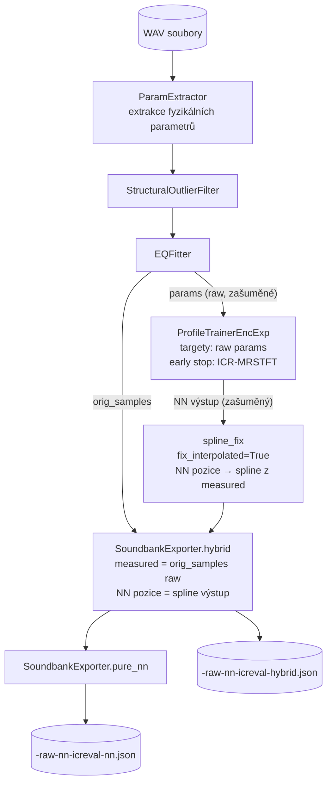
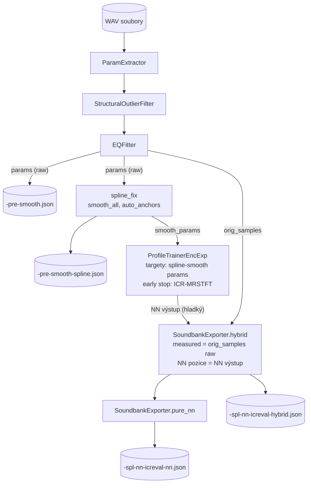
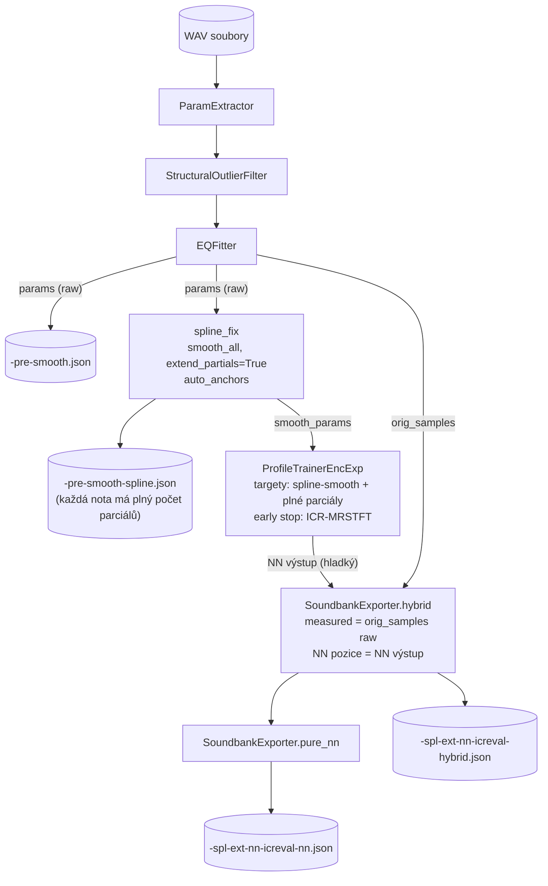
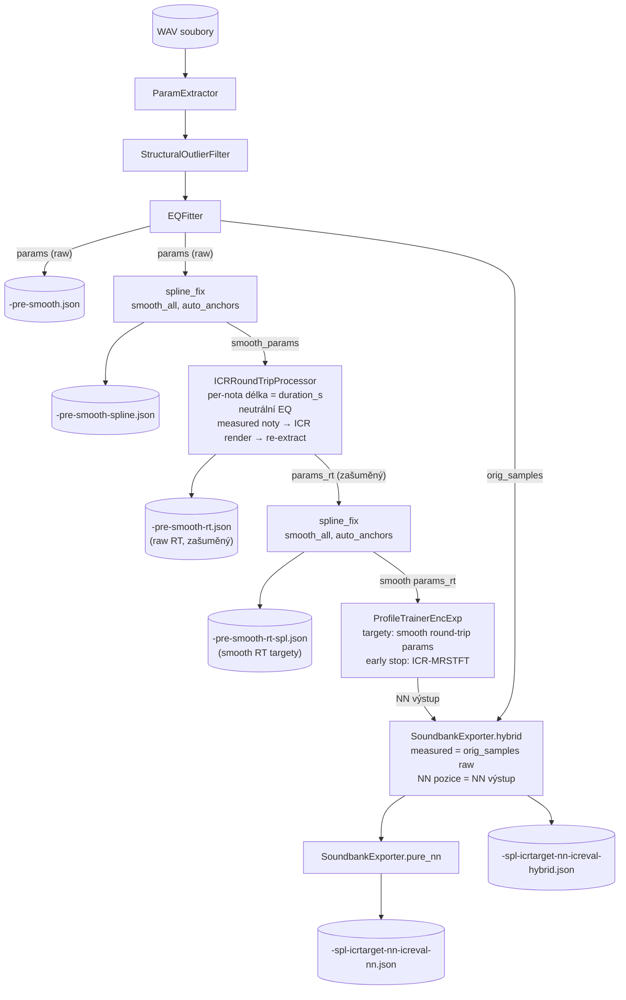
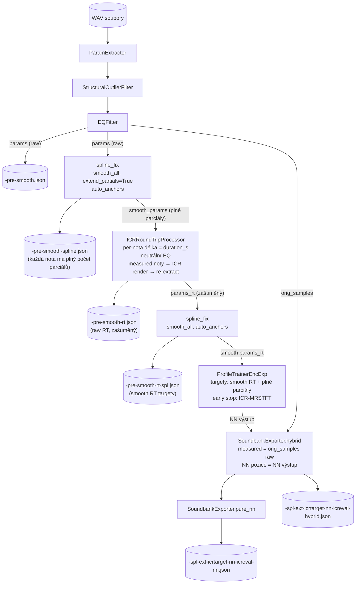
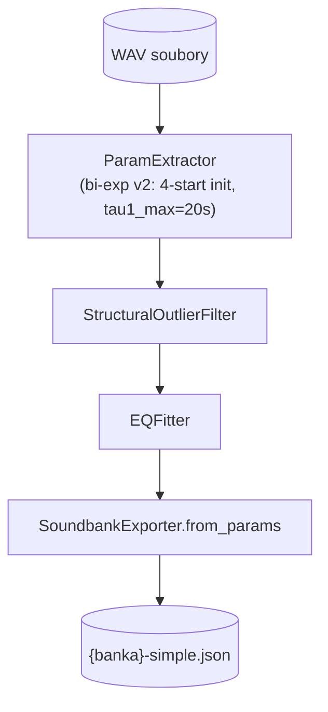
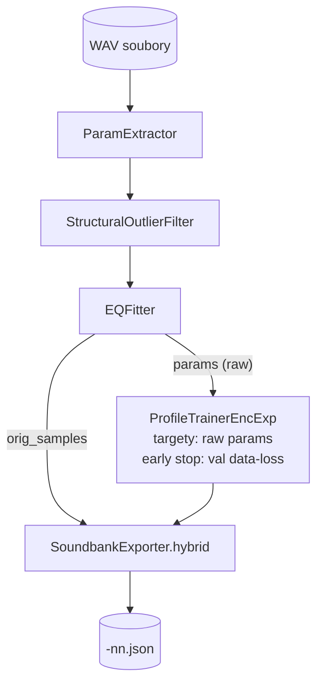
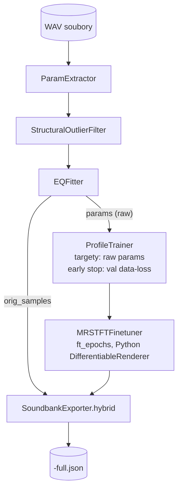

# ICR — Training workflows

Popis všech trénovacích workflows, jejich datového toku a kdy který použít.
Popis jednotlivých modulů → viz [TRAINING_MODULES.md](TRAINING_MODULES.md).
Průvodce od WAV banky po spuštění → viz [TRAIN_BUILD_RUN.md](TRAIN_BUILD_RUN.md).

---

## Přehled workflows

Existují dvě hlavní cesty:

```
WAV banka
  │
  ├── Cesta A: Instrument DNA (bez NN, doporučená pro piano)
  │     simple → analyze_extraction → [anchor_helper] → instrument_dna → soundbank
  │
  └── Cesta B: NN pipeline
        ParamExtractor → StructuralOutlierFilter → EQFitter → NN → export
```

### Instrument DNA

| Krok | Nástroj | Výstup |
|---|---|---|
| Extrakce + EQ | `run-training.py simple` | `soundbanks/{banka}-simple.json` |
| Diagnostika | `tools/analyze_extraction.py` | konzole (bi-exp%, beat%, heatmap) |
| Anotace (volitelné) | `tools/anchor_helper.py` | `anchors/{banka}.json` |
| Generování soundbank | `training/modules/instrument_dna.py` | `soundbanks/{banka}-dna.json` |

Detailní popis → [`docs/INSTRUMENT_DNA.md`](INSTRUMENT_DNA.md).

### NN pipeline — přehled

Všechny NN workflows sdílejí společný základ:

```
WAV banka → ParamExtractor → StructuralOutlierFilter → EQFitter
```

Liší se v přípravě trénovacích targetů a post-exportu:

| Workflow (CLI) | Targety NN | Extend partials | Round-trip | Finální auth. neměřených pozic |
|---|---|---|---|---|
| `raw-nn-icreval` | raw extracted | Ne | Ne | spline_fix (NN je zašuměná) |
| `spl-nn-icreval` | spline-smooth | Ne | Ne | **NN výstup** |
| `spl-ext-nn-icreval` | spline-smooth + plné parciály | Ano (pre-training) | Ne | **NN výstup** |
| `spl-icrtarget-nn-icreval` | spline-smooth + RT korekce | Ne | Ano | **NN výstup** |
| `spl-ext-icrtarget-nn-icreval` | spline-smooth + plné parciály + RT korekce | Ano (pre-training) | Ano | **NN výstup** |

Všechny workflows používají `ProfileTrainerEncExp` a ICR early stop (`ICRBatchEvaluator`).
Tréninkový loss je vždy **MSE na parametrech** (NN výstup vs. targety).

ICR vstupuje do tréninku dvěma způsoby — podle role v názvu:

| Role | Suffix | Co ICR dělá | Gradient přes ICR |
|------|--------|-------------|-------------------|
| `icreval` | všechny WF | renderuje zvuk, počítá MRSTFT → řídí early stop | Ne |
| `icrtarget` | `spl-icrtarget-*` | generuje trénovací targety přes round-trip → definuje, k čemu NN konverguje | Ne |

Gradient přes ICR.exe v žádném případě nepochází (C++ binary, non-diferenciabilní).
V `icrtarget` workflow však ICR zásadně ovlivňuje trénink — ne přes gradient, ale tím,
že mění samotné targety:

```
smooth_params → ICR render → WAV_icr → extractor → params_rt
                                                        ↑
                                        NN loss = MSE(NN_output, params_rt)
```

`params_rt` jsou parametry extrahované z ICR-generovaného zvuku. NN se učí predikovat
hodnoty přizpůsobené ICR syntéznímu modelu — opravuje systematický offset mezi tím,
co extraktor naměřil z reálného klavíru (`smooth_params`), a tím, co extraktor naměří
z ICR-rendered zvuku se stejnými vstupními parametry (`params_rt`).

---

## Klíčový princip: finální autorita pro neměřené pozice

```
icr-eval:         raw → NN → spline_fix(NN)   → hybrid
                  (raw NN zašuměná → spline ji opraví)

smooth-icr-eval:  smooth → NN                 → hybrid
                  (NN trénovaná na smooth datech je důvěryhodná → spline_fix se NEPROVÁDÍ)
```

> **Opravená chyba (historicky):** původní smooth pipeline volala `spline_fix` i po
> tréninku → double-spline, NN výstup zahozen. Spline_fix náleží pouze `icr-eval`.

---

## Workflow: `raw-nn-icreval`

**CLI:** `python run-training.py raw-nn-icreval --bank <dir>`

NN trénuje na surových extrahovaných parametrech. Výstup NN je zašuměný
(tréninkové targety samy obsahují šum měření), proto se po exportu aplikuje
`spline_fix` na interpolované pozice.

### Schéma



### API

```python
from training.pipeline_icr_eval import run

model, out_path = run(
    bank_dir     = "C:/SoundBanks/IthacaPlayer/vv-rhodes",
    out_path     = "soundbanks/params-vv-rhodes-raw-nn-icreval.json",
    epochs       = 5000,
    icr_patience = 15,
    note_dur     = 3.0,
)
```

### Console výstup

```
[1/3] Extracting params...
[2/3] Training NN on raw params (max 5000 epochs)...
  epoch   50/5000  train=X.XXXX  val=X.XXXX  lr=...
    ICR-MRSTFT = X.XXXX  (120/120 notes, 80s)
  Early stop: ICR-MRSTFT no improvement for 15 evals
[3/3] Exporting hybrid + pure-NN banks...
Done -> soundbanks/params-vv-rhodes-icr-eval.json
```

---

## Workflow: `spl-nn-icreval`

**CLI:** `python run-training.py spl-nn-icreval --bank <dir>`

Před tréninkem se measured parametry vyhladí splinem — NN dostane čisté
targety a sama produkuje hladký výstup. `spline_fix` po exportu se neprovádí.

### Schéma



### API

```python
from training.pipeline_smooth_icr_eval import run

model, out_path = run(
    bank_dir     = "C:/SoundBanks/IthacaPlayer/vv-rhodes",
    out_path     = "soundbanks/params-vv-rhodes-spl-nn-icreval.json",
    epochs       = 5000,
    auto_anchors = 12,
    icr_patience = 15,
)
```

---

## Workflow: `spl-ext-nn-icreval`

**CLI:** `python run-training.py spl-ext-nn-icreval --bank <dir>`

Jako `spl-nn-icreval`, ale před tréninkem se každá measured nota rozšíří
na maximální počet parciálů (`extend_partials=True`). Nové parciály jsou
inicializovány splinem z okolních not. NN se tak učí přirozeně predikovat
plný počet parciálů pro všechny pozice.

### Schéma



### Co se mění oproti `spl-nn-icreval`

```python
apply_spline_fix_bank(notes,
                      smooth_all      = True,
                      extend_partials = True,   # ← přidáno
                      auto_anchors    = N)
```

Výsledek: každá measured nota má plný počet parciálů (max přes všechny measured).
NN trénuje na kompletních harmonických targetech od prvního epoch.

### API

```python
model, out_path = run(
    bank_dir        = "C:/SoundBanks/IthacaPlayer/vv-rhodes",
    out_path        = "soundbanks/params-vv-rhodes-smooth-ext-icr-eval.json",
    epochs          = 5000,
    auto_anchors    = 12,
    icr_patience    = 15,
    extend_partials = True,
)
```

---

## Workflow: `spl-icrtarget-nn-icreval`

**CLI:** `python run-training.py spl-icrtarget-nn-icreval --bank <dir>`

Rozšíření `spl-nn-icreval` o **ICR round-trip korekci targetů**.
Místo spline-smooth measured params dostane NN jako targety hodnoty
re-extrahované z ICR-renderovaných zvuků. NN konverguje k tomu, co ICR
skutečně produkuje — ne k tomu, co extrakce naměřila z reálného klavíru.

### Proč round-trip

Extrakce měří reálný nástroj. ICR má vlastní přenosovou funkci — stejné
parametry renderuje jako zvuk, který extraktor změří jinak (systematický
offset per parametr). Trénink na `params_rt` tento offset koriguje:

```
Bez round-tripu:   NN → params → ICR → zvuk ≠ reálný klavír
                   (NN se naučila kompenzovat ICR offset, ale špatně)

S round-tripem:    NN → params_rt → ICR → zvuk ≈ cílový zvuk
                   (NN se naučila přesně co ICR potřebuje)
```

`spectral_eq` je z round-tripu vyloučeno (ICR renderuje s neutrálním EQ).

### Schéma



### API

```python
model, out_path = run(
    bank_dir       = "C:/SoundBanks/IthacaPlayer/vv-rhodes",
    out_path       = "soundbanks/params-vv-rhodes-spl-icrtarget-nn-icreval.json",
    epochs         = 5000,
    auto_anchors   = 12,
    icr_patience   = 15,
    icr_round_trip = True,
)
```

### Časová náročnost

Round-trip přidává před trénink:
1. ICR render všech measured not (per-nota délka = `duration_s` z extraktu)
2. Re-extrakci params z rendered WAVů
3. Druhý spline pass na RT targetech

Celkový overhead ~10–30 min podle počtu measured not, délky not a hardware.
Zbytek pipeline identický se `spl-nn-icreval`.

---

## Workflow: `spl-ext-icrtarget-nn-icreval`

**CLI:** `python run-training.py spl-ext-icrtarget-nn-icreval --bank <dir>`

Kombinace `spl-ext-nn-icreval` a `spl-icrtarget-nn-icreval` — měřené noty jsou
nejprve rozšířeny na plný počet parciálů, vyhlazeny splinem a pak projdou ICR
round-tripem. NN dostane jako targety nejkompletnější a nejpřesnější data:
kompletní harmonická struktura + korekce ICR přenosové funkce.

### Schéma



### Co se mění oproti `spl-icrtarget-nn-icreval`

```python
apply_spline_fix_bank(notes,
                      smooth_all      = True,
                      extend_partials = True,   # ← měřené noty mají plný počet parciálů
                      auto_anchors    = N)
# → ICRRoundTripProcessor.process(smooth_params)  ← round-trip na rozšířených datech
```

Round-trip tak koriguje ICR offset i pro vyšší parciály, které byly doplněny splinem.

### API

```python
model, out_path = run(
    bank_dir        = "C:/SoundBanks/IthacaPlayer/vv-rhodes",
    out_path        = "soundbanks/params-vv-rhodes-spl-ext-icrtarget-nn-icreval.json",
    epochs          = 5000,
    auto_anchors    = 12,
    icr_patience    = 15,
    extend_partials = True,
    icr_round_trip  = True,
)
```

---

## Workflow: `simple`

**CLI:** `python run-training.py simple --bank <dir>`

Bez NN — pouze extrakce, outlier filter, EQ fit a export. Slouží jako:
1. **První krok Instrument DNA pipeline** — výstup jde přímo do `instrument_dna.py`
2. **Rychlý baseline poslech** — soundbanka z reálných dat bez interpolace



```bash
python run-training.py simple --bank "C:/SoundBanks/IthacaPlayer/pl-grand"
# → soundbanks/pl-grand-simple.json

# Bez EQ (rychlejší, vhodné jako vstup pro instrument_dna):
python run-training.py simple --bank "C:/SoundBanks/IthacaPlayer/pl-grand" --skip-eq
```

**Extractor v2 (aktuální):** 4-start bi-exp init, `tau1_max=20s`, criterion `tau2/tau1>1.3`.
Výsledek na pl-grand: bi-exp **77 %**, beat **100 %**. Aktivní ve všech workflows automaticky.

---

## Legacy workflows

Zachovány pro zpětnou kompatibilitu.

### `nn`

NN bez ICR early stop — early stop řídí val data-loss.



```bash
python run-training.py nn --bank C:/SoundBanks/IthacaPlayer/vv-rhodes
```

### `full`

NN + MRSTFT finetuner (Python renderer, pomalé).



```bash
python run-training.py full --bank C:/SoundBanks/IthacaPlayer/ks-grand
```

### `experimental`

Jako `nn`, ale za NN tréninkem následuje `MRSTFTFinetuner` (200 epoch,
Python DifferentiableRenderer). Ponecháno jako legacy.

---

## Srovnání: kdy použít který workflow

| Situace | Doporučený workflow |
|---------|---------------------|
| Piano s dlouhými záznamy (pl-grand, pl-upright) | **Instrument DNA** |
| Rhodes nebo neznámý nástroj — rychlý baseline | `raw-nn-icreval` |
| Produkční banka — nejhladší NN interpolace | `spl-nn-icreval` |
| Piano s bohatým harmonickým obsahem | `spl-ext-nn-icreval` |
| Maximální přesnost syntézního výstupu (s ICR) | `spl-icrtarget-nn-icreval` |
| Maximální přesnost + plný harmonický obsah | `spl-ext-icrtarget-nn-icreval` |

---

## Vlastní workflow (příklady)

### Přeskočit NN, jen vyexportovat s jiným target_rms

```python
from training.modules.extractor  import ParamExtractor
from training.modules.eq_fitter  import EQFitter
from training.modules.exporter   import SoundbankExporter

params = ParamExtractor().extract_bank("C:/SoundBanks/IthacaPlayer/ks-grand")
params = EQFitter().fit_bank(params, "C:/SoundBanks/IthacaPlayer/ks-grand")

SoundbankExporter().from_params(params, "soundbanks/custom.json", sr=44100)
```

### Použít existující model, přeskočit extrakci

```python
from training.modules.profile_trainer_exp import ProfileTrainerEncExp
from training.modules.exporter            import SoundbankExporter
import json

with open("soundbanks/params-vv-rhodes-pre-smooth.json") as f:
    params = json.load(f)

model = ProfileTrainerEncExp().load("training/profile-vv-rhodes.pt")
SoundbankExporter().hybrid(model, params, "soundbanks/new-hybrid.json")
```

### Spustit pouze round-trip korekci na existující smooth bance

```python
from training.modules.icr_round_trip import ICRRoundTripProcessor
import json
from pathlib import Path

smooth_params = json.loads(Path("soundbanks/params-vv-rhodes-pre-smooth-spline.json").read_text())
# (smooth_params musí mít strukturu params dict se "samples" klíčem)

rt = ICRRoundTripProcessor(icr_exe="build/bin/Release/ICR.exe", sr=48000)
params_rt = rt.process(smooth_params, workers=8)
```

### Generovat sample banku z NN pro celý rozsah

```python
from training.modules.generator           import SampleGenerator
from training.modules.profile_trainer_exp import ProfileTrainerEncExp

model = ProfileTrainerEncExp().load("training/profile-ks-grand.pt")
SampleGenerator().generate_bank(
    model,
    out_dir    = "generated/ks-grand-v2/",
    midi_range = (21, 108),
    vel_count  = 8,
    beat_scale = 1.2,
)
```
