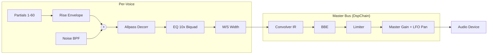

# AdditiveSynthesisPianoCore

Full additive piano synthesis engine.  Extracts physical parameters from WAV
recordings and resynthesizes in real-time using 60-partial additive model with
bi-exponential envelopes, multi-string beating, spectral EQ, and stereo imaging.

CLI: `--core AdditiveSynthesisPianoCore --params <soundbank.json>`

## Synthesis Features

- 60 partials per voice, bi-exponential envelopes (`a1*exp(-t/tau1) + (1-a1)*exp(-t/tau2)`)
- 1/2/3-string beating models (bass/tenor/treble)
- Biquad bandpass hammer noise with exponential decay
- Schroeder allpass stereo decorrelation
- 10-section min-phase spectral EQ cascade (DF-II)
- M/S stereo width correction
- Attack rise envelope (`1 - exp(-t/tau_rise)`)
- Velocity interpolation with `lerpNoteParams()` between 8 layers
- Per-note RMS calibration

## Signal Chain



## PianoVoice State

| State | Type | Description |
|---|---|---|
| `partials[60]` | struct | Per-partial: env_fast/slow, decay, A0, f_hz, beat_hz, phi |
| `noise_bpf` | BiquadCoeffs | Bandpass noise filter |
| `rise_coeff/env` | float | Attack rise envelope |
| `eq_coeffs/wL/wR` | array | EQ biquad cascade state |
| `gl1..gr3` | float | Constant-power pan gains (1/2/3 strings) |
| `ap_g_L/R, ap_x/y` | float | Schroeder allpass state |
| `stereo_width` | float | M/S correction factor |

## PianoPatchManager (additional methods)

| Method | Description |
|--------|-------------|
| `midiVelToFloat(vel)` | Velocity 1-127 -> float 0.0-7.0 |
| `lerpNoteParams(a, b, t)` | Interpolate parameters between velocity layers |

## Documentation

| Doc | Content |
|-----|---------|
| [TRAIN_BUILD_RUN.md](TRAIN_BUILD_RUN.md) | WAV analysis pipeline, run commands, diagnostic tools |
| [JSON_SCHEMA.md](JSON_SCHEMA.md) | Soundbank JSON format (note-level + partial-level keys) |
| [TRAINING_MODULES.md](TRAINING_MODULES.md) | Python extraction modules reference |
| [SYSEX_PARAMS.md](SYSEX_PARAMS.md) | SysEx parameter IDs for live editing |
| [TODO.md](TODO.md) | Priorities, implementation phases, known issues |
| [DEVELOPMENT_LOG.md](DEVELOPMENT_LOG.md) | Physics references, key findings, listening tests |

## Source Files

```
cores/additive_synthesis_piano/
    additive_synthesis_piano_core.h      Voice + VoiceManager + PatchManager + Core
    additive_synthesis_piano_core.cpp    Implementation (~850 lines)
    additive_synthesis_piano_math.h      DSP math (stateless, inline)
```
