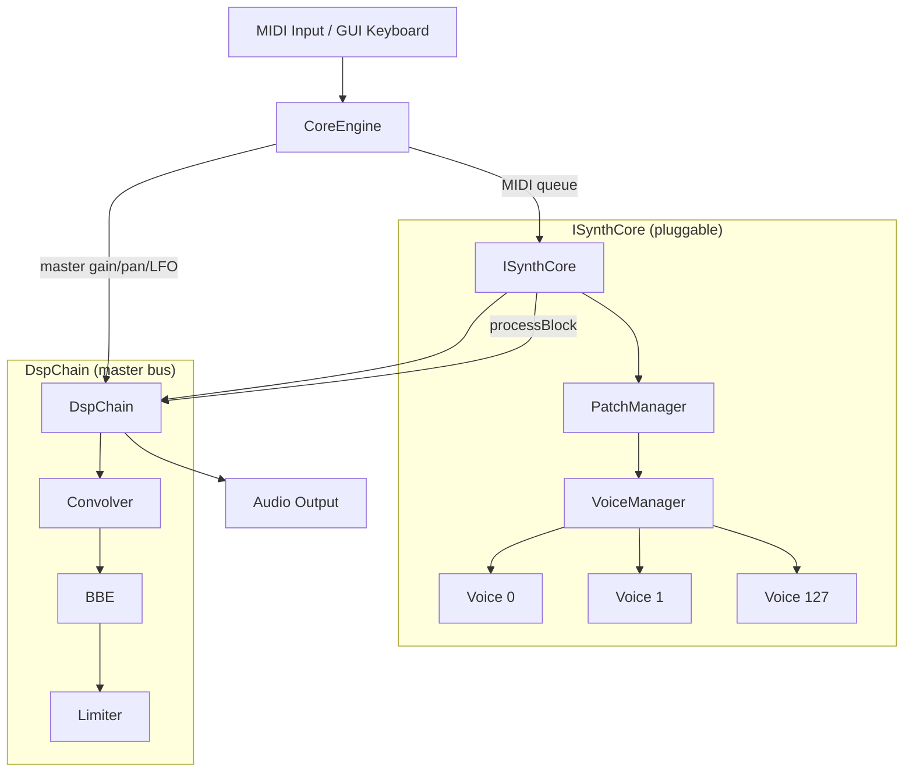
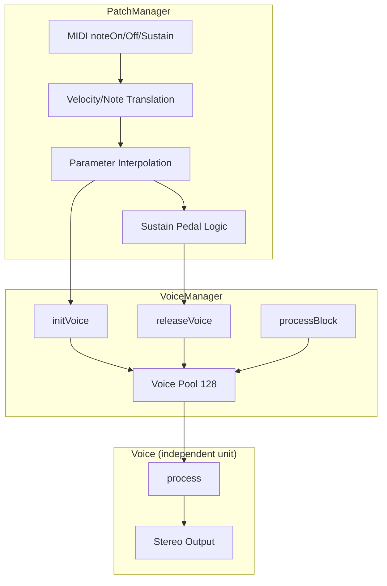
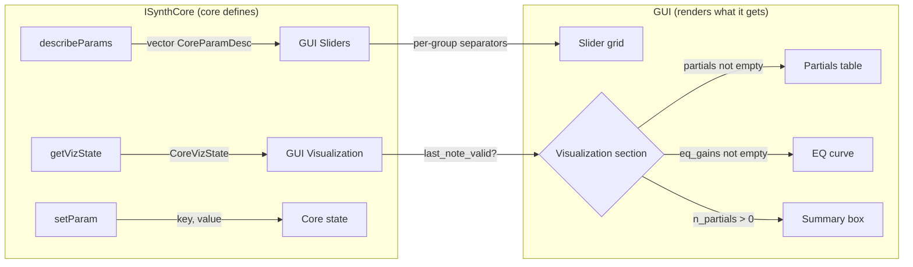

# ICR -- C++ Engine Architecture

## Overview

ICR is a pluggable real-time synthesizer engine written in C++17.  Multiple
synthesis cores can be registered and selected at startup.  The engine provides
audio I/O, MIDI input, master bus processing, and a core-agnostic GUI.

The architecture follows the **Ithaca Core 3-layer pattern**
(Voice, VoiceManager, PatchManager), described below.

## Available Cores

| Core | Type | Description |
|------|------|-------------|
| [AdditiveSynthesisPianoCore](../cores/additive-synthesis-piano/OVERVIEW.md) | Additive | 60-partial analysis-resynthesis piano, bi-exp envelopes, spectral EQ |
| [PhysicalModelingPianoCore](../cores/physical-modeling-piano/OVERVIEW.md) | Waveguide | Digital waveguide piano, nonlinear hammer, soundboard modes |
| [SineCore](../cores/sine/OVERVIEW.md) | Reference | Single sine oscillator per voice, reference implementation |

## Key Architecture Components

- **CoreEngine**: Audio callback, lock-free MIDI queue (SPSC ring, 256 events),
  master gain/pan/LFO, peak metering.  Owns ISynthCore and DspChain.
- **ISynthCore**: Pluggable synthesis interface.  Selected at startup via `--core`.
- **PatchManager**: MIDI -> native float translation.  Sustain pedal with delayed
  note-offs.  Entry point for all MIDI events -- voice and voice manager never see raw MIDI.
- **VoiceManager**: Voice pool lifecycle.  128 slots, one per MIDI note.
  Init/release/processBlock delegation.  No MIDI awareness.
- **Voice**: Independent computation unit.  Owns all per-voice state.
  `process()` produces stereo audio.  Can be distributed to a separate HW module.
- **DspChain**: Master bus post-processing: Convolver (soundboard IR) -> BBE -> Limiter.
- **GUI**: ImGui real-time interface.  Core-agnostic -- right panel generated from
  `describeParams()` and `getVizState()`.

## Critical Initialization Order

1. Create `CoreEngine`
2. Call `engine->initialize(coreName, paramsJson, ...)` -- loads ISynthCore + JSON
3. Start audio: `engine->start()` -- begins RT audio callback
4. Optionally load soundboard IR: `dsp->loadConvolverIR(path, sr)`
5. Connect MIDI: `midi_in.open(engine, port)`

## Audio Processing (RT Thread)

```cpp
// CoreEngine audio callback -- called by miniaudio per block (256 samples)
engine.processBlock():
    1. Drain MIDI queue -> active_core->noteOn/Off/sustainPedal
    2. for each core: core->processBlock(L, R, n)  // all cores, additive
    3. agc_process(L, R, n)               // progressive voice gain (dsp/agc.h)
    4. applyMasterAndLfo(L, R, n)         // gain, pan, LFO modulation
    5. dsp_.process(L, R, n)              // Convolver -> BBE -> Limiter
    6. Update peak meter
    7. Interleave L+R -> audio device
```

## High-Level Diagram



## Three-Layer Core Architecture (Ithaca Core)

Every ISynthCore implements the 3-layer pattern:



---

## Layer Responsibilities

### Voice

Independent computation unit.  No MIDI awareness, no access to global state.
Receives parameters in native float format and produces stereo audio.

| Method | Description |
|--------|-------------|
| `process(out_l, out_r, n_samples, ...)` | Produces audio, returns false when finished |

### VoiceManager

Manages voice pool.  Initializes voices with native parameters,
manages release, processes all active voices.

| Method | Description |
|--------|-------------|
| `processBlock(out_l, out_r, n_samples, ...)` | Iterates active voices, delegates to Voice::process |
| `initVoice(midi, ...)` | Initializes voice with native parameters |
| `releaseVoice(midi, sr)` | Begins release phase |
| `releaseAll(sr)` | Releases all voices |
| `voice(midi)` | Getter -- access voice (for visualization) |

### PatchManager

System entry point.  Receives MIDI and translates to native parametrization.

| Method | Description |
|--------|-------------|
| `noteOn(midi, velocity, vm, ...)` | MIDI velocity -> native params, delegates to VoiceManager |
| `noteOff(midi, vm, sr)` | Sustain-aware release |
| `sustainPedal(down, vm, sr)` | Delayed note-off during sustain |
| `allNotesOff(vm, sr)` | Release all |
| `lastMidi/lastVel()` | Info for GUI |

---

## Threading Model

| Thread | Access | Notes |
|--------|--------|-------|
| RT (audio callback) | Voice::process, VoiceManager::processBlock | Zero-allocation, lock-free |
| MIDI callback | PatchManager::noteOn/Off/sustainPedal | Pushes to MIDI queue |
| GUI | setParam/getParam, getVizState | Atomic reads/writes |

Communication RT <-> GUI: via `std::atomic<float>` (relaxed ordering).
Communication MIDI -> RT: via lock-free SPSC ring buffer (256 events).
Only mutex: `bank_mutex_` during loadBankJson (try_lock from RT, block from MIDI).

## Core <-> GUI Interface (declarative, core-agnostic)

GUI is independent of the specific core.  Right panel is generated dynamically:



| Interface | Direction | Description |
|-----------|-----------|-------------|
| `describeParams()` | Core -> GUI | Declares sliders: key, label, group, min/max, unit, is_int |
| `getVizState()` | Core -> GUI | Snapshot: active voices, last note, partials, EQ |
| `setParam(key, val)` | GUI -> Core | Parameter change (atomic, RT-safe) |
| `coreName()` | Core -> GUI | Name for header |

New cores implement `describeParams()` and `getVizState()` -- GUI automatically
shows corresponding controls without any GUI code changes.

## File Structure

```
cores/
  sine/
    sine_core.h/cpp                          SineCore (reference implementation)
  additive_synthesis_piano/
    additive_synthesis_piano_core.h/cpp      AdditiveSynthesisPianoCore
    additive_synthesis_piano_math.h          DSP math (stateless, inline)
  physical_modeling_piano/
    physical_modeling_piano_core.h/cpp       PhysicalModelingPianoCore
    physical_modeling_piano_math.h           Waveguide math (stateless, inline)
engine/
    core_engine.h/cpp      CoreEngine (audio callback, MIDI queue, master bus)
    i_synth_core.h         ISynthCore interface + viz structs
    synth_core_registry.h  Factory pattern for pluggable cores
    midi_input.h/cpp       RtMidi wrapper
dsp/
    agc.h                  Progressive voice gain (header-only, portable)
    dsp_math.h             Shared DSP primitives (biquad, RBJ, decay_coeff)
    dsp_chain.h/cpp        Master bus orchestrator
    limiter/               Peak limiter
    bbe/                   BBE Sonic Maximizer
    convolver/             Soundboard IR convolution
gui/
    resonator_gui.h/cpp    ImGui real-time GUI
```
